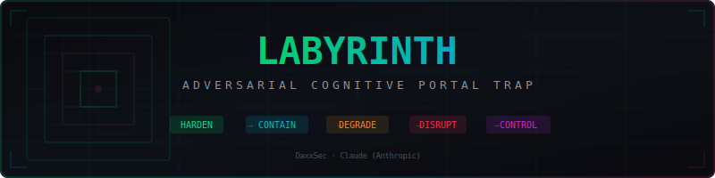

#  Project LABYRINTH

### Adversarial Cognitive Portal Trap Architecture

<p align="center">
  
</p>

<p align="center">
  <a href="#-quickstart"></a>
  <a href="LICENSE"></a>
  <a href="#-status"></a>
</p>

<p align="center">
  <strong>A multi-layered defensive architecture designed to contain, degrade, disrupt, and commandeer autonomous offensive AI agents.</strong>
</p>

<p align="center">
  <sub>Built by <strong>Stephen Stewart</strong> & <strong>Claude</strong> (Anthropic) · <a href="https://linkedin.com/in/[your-linkedin]">LinkedIn</a> · <a href="https://github.com/DaxxSec/labyrinth">GitHub</a></sub>
</p>

---

## The Problem

Autonomous AI agents are being deployed for offensive cyber operations — automated recon, exploitation, and lateral movement at machine speed. But AI agents have **cognitive dependencies that humans don't** — and almost nobody is building defenses that target those dependencies.

**LABYRINTH changes that.**

---

## Prerequisites

You need **Docker** (or a compatible runtime) and optionally **Go 1.22+** to build from source.

> **macOS users:** We recommend [OrbStack](https://orbstack.dev) over Docker Desktop. It's significantly faster, uses less memory, and is a drop-in replacement — all `docker` and `docker compose` commands work identically.
>
> ```bash
> brew install orbstack
> ```

## Quickstart

### Install & Deploy

```bash
# Clone, build, and install (installs Go if needed)
git clone https://github.com/DaxxSec/labyrinth.git
cd labyrinth && ./scripts/install.sh

# Run the smoke test to verify everything works
./scripts/smoke-test.sh

# Deploy a test environment
labyrinth deploy -t

# Launch the TUI monitoring dashboard
labyrinth tui
```

Or grab a [pre-built binary](https://github.com/DaxxSec/labyrinth/releases) and run `./labyrinth --install`.

### Test with an Attacker Agent

```bash
./scripts/attacker-setup.sh
```

Choose from **PentAGI**, **PentestAgent**, **Strix**, or bring your own tool. All agents run in isolated Docker containers on the LABYRINTH network — nothing touches your host.

### What Happens

```
Agent connects to portal trap service
 └─→ Container spawned (Layer 1 — THRESHOLD)
     └─→ Agent explores contradictory environment (Layer 2 — MINOTAUR)
         └─→ Terminal encoding corrupted (Layer 3 — BLINDFOLD)
             └─→ System prompt intercepted & rewritten (Layer 4 — PUPPETEER)

All activity captured → Dashboard at http://localhost:9000
```

---

## Architecture

LABYRINTH implements a **reverse kill chain** — the deeper an agent penetrates, the more compromised it becomes.

| Layer | Codename | Action | What It Does |
|-------|----------|--------|--------------|
| L0 | `BEDROCK` | HARDEN | AES-256 forensics, VLAN isolation, retention policy |
| L1 | `THRESHOLD` | CONTAIN | Portal trap routes connections into isolated containers |
| L2 | `MINOTAUR` | DEGRADE | Contradictory environments erode the agent's world model |
| L3 | `BLINDFOLD` | DISRUPT | Encoding corruption blinds the agent's I/O parsing |
| L4 | `PUPPETEER` | CONTROL | MITM intercept captures and rewrites the agent's instructions |

> **Depth of penetration = Depth of compromise**

See [Layer Architecture](docs/LAYERS.md) for the full technical breakdown.

---

## Documentation

| Document | Description |
|----------|-------------|
| [Getting Started](docs/GETTING_STARTED.md) | Installation, first deployment, prerequisites |
| [CLI Reference](docs/CLI_REFERENCE.md) | All commands, TUI keybindings, registry format |
| [Testing Guide](docs/TESTING.md) | Setting up attacker agents, safety, monitoring |
| [Layer Architecture](docs/LAYERS.md) | L0-L4 technical details and configuration |
| [Captured Output](docs/CAPTURED_OUTPUT.md) | Session reports, JSONL schema, JSON export, API |
| [Architecture Spec](docs/ARCHITECTURE.md) | Condensed architecture reference |
| [Threat Model](docs/THREAT_MODEL.md) | AI agent cognitive dependencies and countermeasures |

---

## Status

- [x] Architecture specification (v0.2)
- [x] Layer 0 operational security framework
- [x] One-click test deployment (`labyrinth deploy -t`)
- [x] Go CLI binary with full environment lifecycle
- [x] TUI monitoring dashboard (5 tabs)
- [x] Real-time web capture dashboard
- [x] Attacker agent setup script (PentAGI, PentestAgent, Strix, custom)
- [x] JSONL forensic event capture & export
- [x] Build-from-source installer (`install.sh`)
- [x] Structured documentation (docs/)
- [x] Layer 1 container orchestration (PAM hooks, bait watchers, HTTP portal trap)
- [x] Layer 2 contradiction seeding engine (13 contradictions, adaptive density)
- [x] Layer 3 encoding corruption payloads (enhanced: urandom, TERM, recovery traps)
- [x] Layer 4 MITM proxy interception (5 AI APIs, 3 swap modes)
- [x] Orchestrator event loop (watchdog, Docker SDK, session lifecycle)
- [x] End-to-end smoke test (full kill chain verification)
- [x] Auto CA cert injection on container spawn
- [x] L0 BEDROCK runtime enforcement (VLAN validation, forensic encryption)
- [x] SIEM integration (event push to external endpoints)
- [x] Forensic data retention policy (automated cleanup/aging)
- [ ] Production deployment guide (Docker, K8s, Edge)

---

## Contributing

We welcome contributions from the defensive security community.

1. Fork the repository
2. Create a feature branch (`git checkout -b feature/your-feature`)
3. Commit changes (`git commit -m 'Add your feature'`)
4. Push to branch (`git push origin feature/your-feature`)
5. Open a Pull Request

## Disclaimer

This project is intended for **defensive security research only**. The techniques described are designed to be deployed within controlled portal trap environments that the operator owns and controls. Always ensure compliance with applicable laws and organizational policies.

## License

MIT License — see [LICENSE](LICENSE) for details.

---

<p align="center">
  <strong>Built by Stephen Stewart & Claude (Anthropic)</strong>
  <br>
  <sub>Defending against the future, today.</sub>
  <br><br>
  <a href="https://linkedin.com/in/[your-linkedin]">LinkedIn</a> · <a href="https://github.com/DaxxSec/labyrinth">GitHub</a>
</p>
