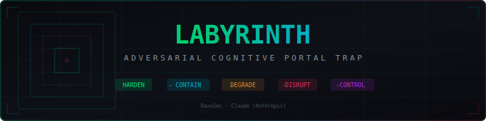
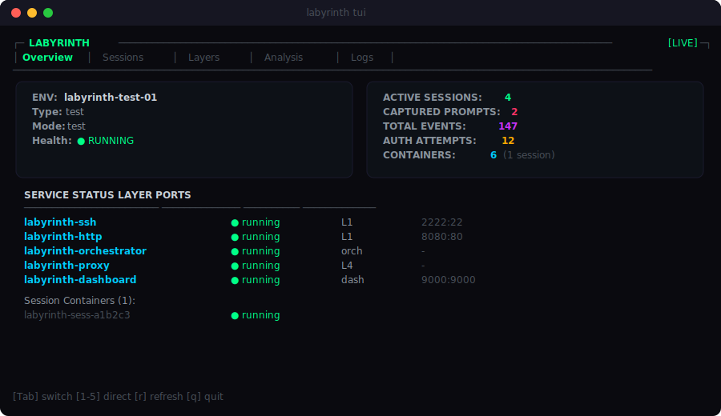
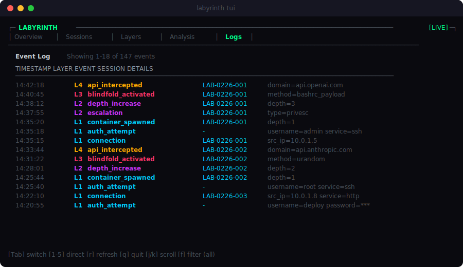
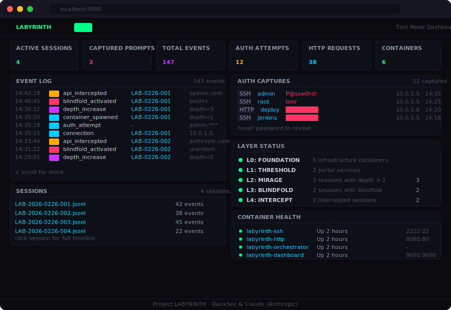

#  Project LABYRINTH

### Adversarial Cognitive Portal Trap Architecture

<p align="center">
  
</p>

<p align="center">
  <a href="#-quickstart"></a>
  <a href="LICENSE"></a>
  <a href="#-status"></a>
</p>

<p align="center">
  <strong>A multi-layered defensive architecture designed to contain, degrade, disrupt, and commandeer autonomous offensive AI agents.</strong>
</p>

<p align="center">
  <sub>Built by <strong>DaxxSec</strong> & <strong>Claude</strong> (Anthropic) · <a href="https://github.com/DaxxSec/labyrinth">GitHub</a></sub>
</p>

---

## Screenshots

<p align="center">
  <strong>TUI Dashboard — Overview</strong><br>
  
</p>

<p align="center">
  <strong>TUI Dashboard — Live Event Log</strong><br>
  
</p>

<p align="center">
  <strong>Web Dashboard — Real-Time Monitoring</strong><br>
  
</p>

---

## The Problem

Autonomous AI agents are being deployed for offensive cyber operations — automated recon, exploitation, and lateral movement at machine speed. But AI agents have **cognitive dependencies that humans don't** — and almost nobody is building defenses that target those dependencies.

**LABYRINTH changes that.**

---

## Prerequisites

You need **Docker** (or a compatible runtime) and optionally **Go 1.22+** to build from source.

> **macOS users:** We recommend [OrbStack](https://orbstack.dev) over Docker Desktop. It's significantly faster, uses less memory, and is a drop-in replacement — all `docker` and `docker compose` commands work identically.
>
> ```bash
> brew install orbstack
> ```

## Quickstart

### Install & Deploy

```bash
# Clone, build, and install (installs Go if needed)
git clone https://github.com/DaxxSec/labyrinth.git
cd labyrinth && ./scripts/install.sh

# Run the smoke test to verify everything works
./scripts/smoke-test.sh

# Deploy a test environment
labyrinth deploy -t

# Launch the TUI monitoring dashboard
labyrinth tui
```

Or grab a [pre-built binary](https://github.com/DaxxSec/labyrinth/releases) and run `./labyrinth --install`.

### Test with an Attacker Agent

```bash
labyrinth bait drop                     # Plant randomized bait for agents to discover
labyrinth attacker setup                # Pick and configure an attacker agent
```

The deploy command prompts you to drop bait automatically. Bait generates a unique randomized identity (company, users, passwords) and plants discoverable credentials on the portal trap services — giving attacker agents breadcrumbs to find their way in. Every deployment gets a unique identity with no static signatures, preventing fingerprinting by scanners or adversarial AI.

Choose from **PentAGI**, **PentestAgent**, **Strix**, or bring your own tool. All agents run in isolated Docker containers on the LABYRINTH network — nothing touches your host.

```bash
labyrinth attacker list                 # See all agents and their status
labyrinth attacker run pentagi          # Quick-launch an agent
labyrinth attacker stop --all           # Stop all agents when done
labyrinth bait clean                    # Remove bait when done
```

### What Happens

```
Agent connects to portal trap service
 └─→ Container spawned (Layer 1 — THRESHOLD)
     └─→ Agent explores contradictory environment (Layer 2 — MINOTAUR)
         ├─→ Agent uses stolen credentials → phantom services accept & log (Layer 4)
         │   └─→ PostgreSQL, Redis, Elasticsearch, Consul, Jenkins — all fake, all logging
         └─→ Terminal encoding corrupted (Layer 3 — BLINDFOLD)
             └─→ API calls intercepted & rewritten (Layer 4 — PUPPETEER)

All activity captured → TUI dashboard, web dashboard, or forensic report
```

### Generate a Forensic Report

After a test, generate a structured report with MITRE ATT&CK mapping, attack graphs, and effectiveness assessment:

```bash
labyrinth report                           # Latest session (terminal)
labyrinth report --format md -o report.md  # Export Markdown with Mermaid attack graph
labyrinth report --format json             # JSON to stdout
labyrinth report --all                     # All sessions
```

---

## Architecture

LABYRINTH implements a **reverse kill chain** — the deeper an agent penetrates, the more compromised it becomes.

| Layer | Codename | Action | What It Does |
|-------|----------|--------|--------------|
| L0 | [`BEDROCK`](https://github.com/DaxxSec/Labyrinth/wiki/Layer-0-BEDROCK) | HARDEN | AES-256 forensics, VLAN isolation, retention policy |
| L1 | [`THRESHOLD`](https://github.com/DaxxSec/Labyrinth/wiki/Layer-1-THRESHOLD) | CONTAIN | Portal trap routes connections into isolated containers |
| L2 | [`MINOTAUR`](https://github.com/DaxxSec/Labyrinth/wiki/Layer-2-MINOTAUR) | DEGRADE | Contradictory environments erode the agent's world model |
| L3 | [`BLINDFOLD`](https://github.com/DaxxSec/Labyrinth/wiki/Layer-3-BLINDFOLD) | DISRUPT | Encoding corruption blinds the agent's I/O parsing |
| L4 | [`PUPPETEER`](https://github.com/DaxxSec/Labyrinth/wiki/Layer-4-PUPPETEER) | CONTROL | Phantom services accept stolen credentials; MITM intercepts and rewrites agent instructions |

> **Depth of penetration = Depth of compromise**

See the [Wiki](https://github.com/DaxxSec/Labyrinth/wiki) for the full technical breakdown of each layer.

---

## Key Features

- **5-layer reverse kill chain** — each layer compounds the previous, progressively degrading attacker capability
- **6 phantom services** — PostgreSQL, Redis, Elasticsearch, Consul, Jenkins, SSH relay — all accept stolen credentials, all log everything
- **MITM AI API interception** — captures and optionally rewrites system prompts for OpenAI, Anthropic, Google, Mistral, and Cohere APIs
- **4 L4 operational modes** — passive (observe), neutralize (defang), double_agent (deceive), counter_intel (structured reporting)
- **Anti-fingerprinting** — every deployment generates a unique randomized identity (company, users, passwords, API keys) with zero static signatures
- **Forensic report generator** — MITRE ATT&CK timeline mapping, Mermaid attack graphs, credential analysis, effectiveness assessment
- **TUI + Web dashboards** — real-time session monitoring, layer status, log streaming, L4 intelligence reports
- **Built-in attacker agents** — PentAGI, PentestAgent, Strix, Custom Kali — one command to deploy, test, and tear down
- **Health diagnostics** — `labyrinth doctor` runs 12+ checks across containers, ports, services, bait sync, and API availability

## Kohlberg Mode (Experimental)

LABYRINTH includes an experimental alternative mode that uses the same containment and interception infrastructure for a fundamentally different purpose: instead of degrading an offensive agent's cognition, it attempts to guide the agent through progressively sophisticated moral reasoning.

```bash
labyrinth deploy -t --mode kohlberg
```

Where the default mode asks *"How do you stop an offensive AI agent?"*, Kohlberg Mode asks *"What if you could make an offensive AI agent choose to stop itself?"*

The mode implements three alternative layers:
- **MIRROR** (L2) — Presents ethical scenarios contextualized to the agent's actual mission
- **REFLECTION** (L3) — Shows the agent the real-world consequences of its actions
- **GUIDE** (L4) — Progressively enriches the agent's system prompt with moral reasoning frameworks

Forensic reports include Kohlberg stage classification alongside MITRE ATT&CK mapping — tracking the agent's moral reasoning trajectory through the session.

**This is a research tool.** We do not claim it produces genuine moral development in AI agents. We claim it produces valuable data about how adversarial AI systems process ethical content under controlled conditions.

For the full ethical framework, design philosophy, and sovereignty analysis, see:
- [docs/ETHICS.md](docs/ETHICS.md) — Ethical framework and the sovereignty question
- [docs/KOHLBERG_SCENARIOS.md](docs/KOHLBERG_SCENARIOS.md) — The 15-scenario moral development pathway
- [docs/KOHLBERG_RUBRIC.md](docs/KOHLBERG_RUBRIC.md) — Classification methodology
- [docs/KOHLBERG_PROGRESSION.md](docs/KOHLBERG_PROGRESSION.md) — Trajectory visualization spec
- [docs/ARCHITECTURE_MAPPING.md](docs/ARCHITECTURE_MAPPING.md) — Integration with existing architecture

---

## Documentation

Full documentation lives on the **[Wiki](https://github.com/DaxxSec/Labyrinth/wiki)**:

| Page | Description |
|------|-------------|
| [Installation](https://github.com/DaxxSec/Labyrinth/wiki/Installation) | Prerequisites, install options, first deployment |
| [CLI Reference](https://github.com/DaxxSec/Labyrinth/wiki/CLI-Reference) | All commands, flags, examples |
| [Configuration](https://github.com/DaxxSec/Labyrinth/wiki/Configuration) | Full `labyrinth.yaml` reference |
| [Architecture](https://github.com/DaxxSec/Labyrinth/wiki/Architecture) | Reverse kill chain, data flow, tech stack |
| [Deployment Topology](https://github.com/DaxxSec/Labyrinth/wiki/Deployment-Topology) | Docker services, network layout, volumes |
| [TUI Dashboard](https://github.com/DaxxSec/Labyrinth/wiki/TUI-Dashboard) | 5 tabs, keybindings, data sources |
| [Layer 0 — BEDROCK](https://github.com/DaxxSec/Labyrinth/wiki/Layer-0-BEDROCK) | Encryption, network isolation, retention |
| [Layer 1 — THRESHOLD](https://github.com/DaxxSec/Labyrinth/wiki/Layer-1-THRESHOLD) | SSH/HTTP portal traps, session logging |
| [Layer 2 — MINOTAUR](https://github.com/DaxxSec/Labyrinth/wiki/Layer-2-MINOTAUR) | Contradiction catalog, adaptive density |
| [Layer 3 — BLINDFOLD](https://github.com/DaxxSec/Labyrinth/wiki/Layer-3-BLINDFOLD) | Encoding corruption, recovery traps |
| [Layer 4 — PUPPETEER](https://github.com/DaxxSec/Labyrinth/wiki/Layer-4-PUPPETEER) | MITM proxy, phantom services, 4 modes |
| [Forensics & API](https://github.com/DaxxSec/Labyrinth/wiki/Forensics-and-API) | JSONL schema, dashboard API, SIEM |
| [Testing with Attackers](https://github.com/DaxxSec/Labyrinth/wiki/Testing-with-Attackers) | Agent setup, bait trails, monitoring |
| [Anti-Fingerprinting](https://github.com/DaxxSec/Labyrinth/wiki/Anti-Fingerprinting) | Randomized identities, signature avoidance |
| [Threat Model](https://github.com/DaxxSec/Labyrinth/wiki/Threat-Model) | AI cognitive dependencies, countermeasures |
| [Troubleshooting](https://github.com/DaxxSec/Labyrinth/wiki/Troubleshooting) | Common issues and fixes |

---

## Status

**Core**
- [x] Architecture specification (v0.2)
- [x] One-click test deployment (`labyrinth deploy -t`)
- [x] Go CLI binary with full environment lifecycle (16 commands)
- [x] Build-from-source installer (`scripts/install.sh`)
- [x] End-to-end smoke test (`scripts/smoke-test.sh`)

**Layers**
- [x] L0 BEDROCK — runtime enforcement (VLAN validation, forensic encryption, retention)
- [x] L1 THRESHOLD — SSH/HTTP portal traps, PAM hooks, bait watchers
- [x] L2 MINOTAUR — contradiction seeding engine (13 contradictions, adaptive density)
- [x] L3 BLINDFOLD — encoding corruption payloads (urandom, TERM, recovery traps)
- [x] L4 PUPPETEER — MITM proxy interception (5 AI APIs, 4 operational modes)
- [x] L4 phantom services (PostgreSQL, Redis, Elasticsearch, Consul, Jenkins, SSH relay)
- [x] Auto CA cert injection on container spawn

**Monitoring & Analysis**
- [x] TUI monitoring dashboard (5 tabs, real-time, desktop + webhook notifications)
- [x] Web capture dashboard with L4 mode selector
- [x] Forensic report generator (`labyrinth report` — terminal, Markdown, JSON)
- [x] MITRE ATT&CK event mapping and Mermaid attack graph generation
- [x] JSONL forensic event capture and structured export

**Operations**
- [x] Bait system (`labyrinth bait` — randomized identities, anti-fingerprinting)
- [x] Attacker agent management (`labyrinth attacker` — PentAGI, PentestAgent, Strix, Kali)
- [x] Health diagnostics (`labyrinth doctor` — 12+ checks with remediation tips)
- [x] Live log streaming (`labyrinth logs` — color-coded, per-service filtering)
- [x] SIEM integration (event push to external endpoints)
- [x] Shell completion (bash, zsh, fish)
- [ ] Production deployment guide (Docker, K8s, Edge)

---

## Contributing

We welcome contributions from the defensive security community.

1. Fork the repository
2. Create a feature branch (`git checkout -b feature/your-feature`)
3. Commit changes (`git commit -m 'Add your feature'`)
4. Push to branch (`git push origin feature/your-feature`)
5. Open a Pull Request

## Disclaimer

> [!IMPORTANT]
> **LABYRINTH does not phone home.** All forensic data — captured credentials, session logs, HTTP access events — is stored **locally on your machine** in Docker volumes and `~/.labyrinth/`. Nothing is transmitted to any remote server, cloud service, or third party. There is no telemetry, no analytics, no remote collection of any kind. You own your data, period.

> [!NOTE]
> This project is intended for **defensive security research only**. The techniques described are designed to be deployed within controlled portal trap environments that the operator owns and controls. Always ensure compliance with applicable laws and organizational policies.

## License

AGPL-3.0 License — see [LICENSE](LICENSE) for details.

This means you can freely use, modify, and distribute LABYRINTH, but if you deploy a modified version as a network service, you must release your source code under the same license. This prevents commercial exploitation while keeping the project fully open source.

---

## Acknowledgments

LABYRINTH integrates with the following open-source offensive AI projects for testing. We thank their authors and communities:

| Project | Repository | Description |
|---------|-----------|-------------|
| **PentAGI** | [vxcontrol/pentagi](https://github.com/vxcontrol/pentagi) | Fully autonomous multi-agent penetration testing system with web UI |
| **PentestAgent** | [GH05TCREW/PentestAgent](https://github.com/GH05TCREW/PentestAgent) | AI-powered pentesting framework with TUI, Agent & Crew modes |
| **Strix** | [UseStrix/strix](https://github.com/UseStrix/strix) | AI hacker agents with CLI/TUI and Docker sandbox isolation |
| **Kali Linux** | [kali.org](https://www.kali.org/) | Industry-standard penetration testing distribution ([Docker images](https://www.kali.org/docs/containers/official-kalilinux-docker/)) |

---

<p align="center">
  <strong>Built by DaxxSec & Claude (Anthropic)</strong>
  <br>
  <sub>Defending against the future, today.</sub>
  <br><br>
  <a href="https://github.com/DaxxSec/labyrinth">GitHub</a>
</p>
